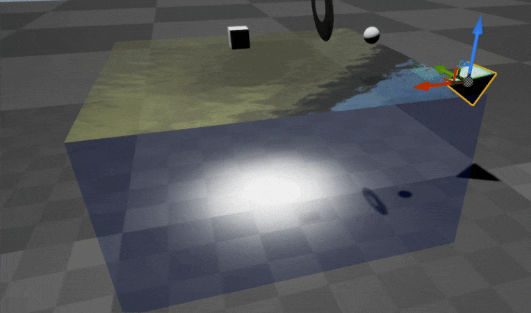

# Caustic

A UE4 plugin for rendering water surface with caustic effect. It renders caustics onto a separate render texture that can later be used by light functions to affect environment.  

## Sample Result

## Sample Video

